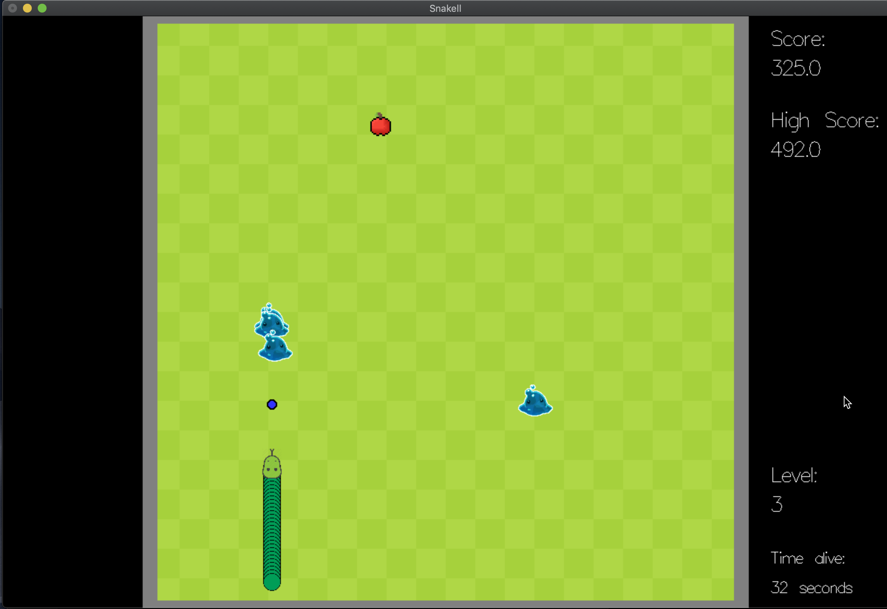

# Snakell

## Detalhes do Projeto

Jogo desenvolvido em Haskell usando o pacote [Gloss](https://hackage.haskell.org/package/gloss-1.13.2.2/docs/Graphics-Gloss.html).

## Começando

Para rodar o jogo, rode o comando "stack run".

## Comandos do Jogo

| Ação         | Tecla    |
| ------------ | ------ |
| Iniciar Jogo | a      |
| Esquerda     | &larr; |
| Direita      | &rarr; |
| Cima         | &uarr; |
| Baixo        | &darr; |
| Atirar       | s      |

## Print do jogo

